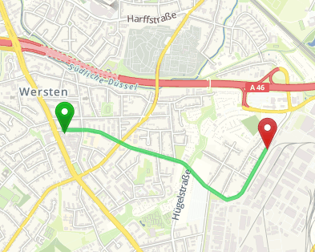

# GraphHopper Traffic Data Integration

This project makes traffic information integration into GraphHopper possible. In the example we are using real time traffic from Cologne and update every ~2 minutes, the UI will update too. The web UI is basically a slightly changed [GraphHopper Maps UI](https://graphhopper.com/maps/) with the traffic data in a separate HTML5 canvas layer:


The nice thing is that the routing changes immediately after recieving the traffic data, i.e. in real time.

Note: When using the speed mode (prepare.chWeighting=fastest) real time is not possible for large areas as you'll have to prepare the data again after new data arrived which will take roughly 9 minutes for Germany. So only near-real-time.

# Start for example area Cologne

Three simple steps:

 * wget http://download.geofabrik.de/europe/germany/nordrhein-westfalen/koeln-regbez-latest.osm.pbf
 * ./td.sh datasource=koeln-regbez-latest.osm.pbf
 * visit http://localhost:8989 to try routing in the UI and see traffic infos

There is an endpoint to fetch all roads with changes which is used for the traffic info:
 * http://localhost:8989/roads

# Start for any area

Disable the update for Cologne in the source, [pick your location](https://github.com/graphhopper/open-traffic-collection) and start the server for your area:

 * ./td.sh datasource=your-osm-file.pbf
 * visit http://localhost:8989 to try routing in our UI

Now feed some data to '/datafeed':

```bash
curl -H "Content-Type: application/json" --data @traffic.json http://localhost:8989/datafeed
```

... and try routing again. Note, in order to use the provided example `traffic.json` you'll have to use the specific area, get it [here](http://download.geofabrik.de/europe/germany/nordrhein-westfalen/duesseldorf-regbez-latest.osm.pbf)



# Data Format

The data format is very generic and can be used for other information influencing routing:

```json
[{
   "id": "1",
   "points": [[6.827273, 51.190264]],
   "value": 10,
   "value_type": "speed",
   "mode": "REPLACE"
}, {
   "id": "somethingelse",
   "points": ...
}
]
```

Note, the point list is in geo json and therefor use lon,lat instead of the more common lat,lon order

# License

This code stands under the Apache License 2.0
